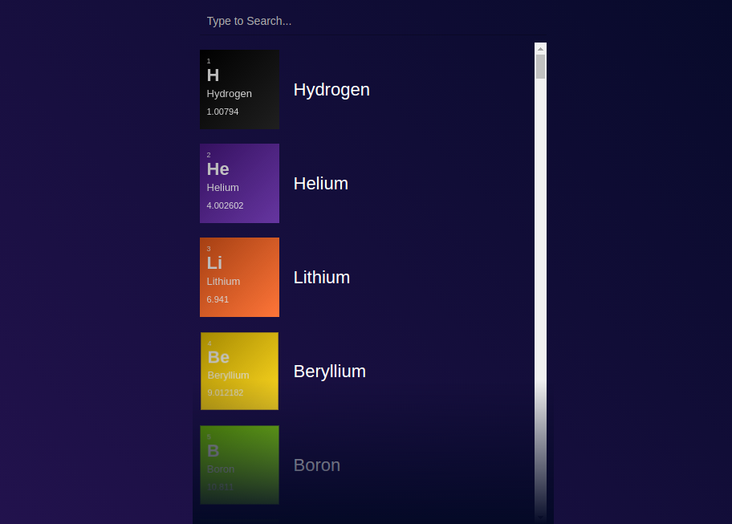

## About
This project was bootstrapped with [Create React App](https://github.com/facebookincubator/create-react-app).
This is a search component written in react. The app shows a list of periodic elements and a search bar. The search term entered by user filters the list. The design is inspired from [Jack Oliver's search component](https://codepen.io/jackoliver/pen/woLNJx).

## Screenshots


## How to use
``` bash
$ git clone https://github.com/mohinderps/search.git
$ npm install
$ npm start
```
#### Do star mark the repo in case you like it.
